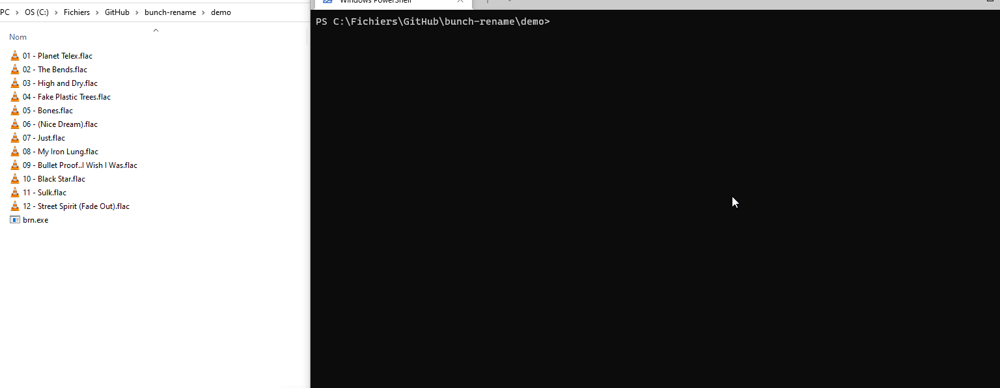
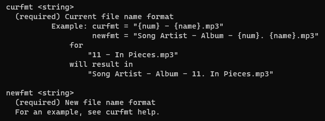

# Bunch rename
A cli tool to change file name format

## Why does this exists?

One night I wanted to rename a bunch
of bad formatted musics to add the
author name and the album at the
beginning of each files, but since I'm
a developer, instead of renaming each
song one after the other I decided to
spent a night creating this software.

I wanted to use a simple custom format
language, so I created an intuitive
syntax to easily rename a bunch of
files.

Since I'm relatively a beginner in C++
I spent some time fixing errors, mostly
in the parser.

## How the custom format works?

The custom format is made to be simple.
For now, it is simple but relatively
limited.
I plan to add support for standard
regexes too.

The custom format support 2 types of
things : VARs and TEXTs.
- VARs are undetermined text elements with undetermined length and content.
An example of var element would be
"{name}".
- TEXTs are determined text elements
with determined content and length.
An example of text element would be
"foo".

The format is supposed to be intuitive
enough that it needs no complex
explanations, and can be used with
curfmt help alone.

Antoine James Tournepiche
